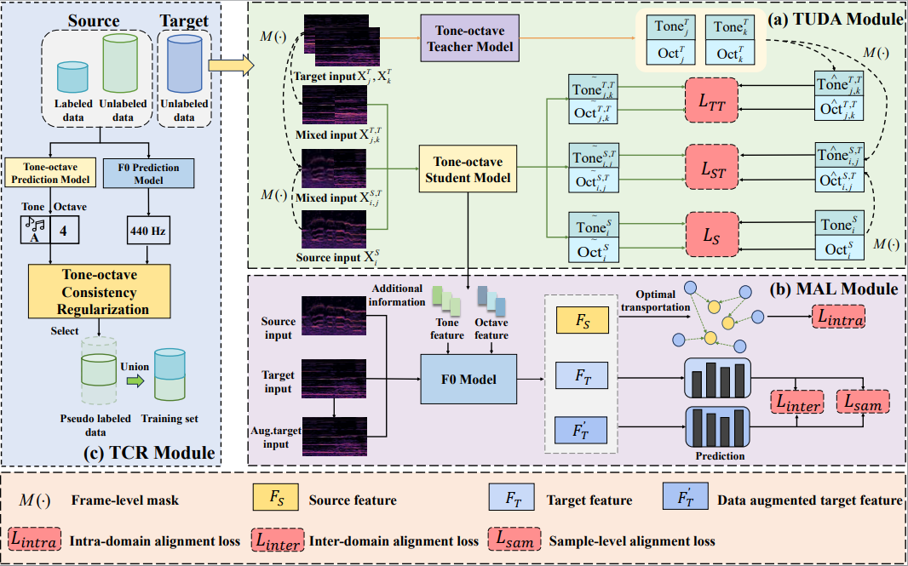

# DUDA: A Two-stage Decoupling Unsupervised Domain Adaptation Framework for Semi-supervised Singing Melody Extraction from Polyphonic Music

This repository contains the offical PyTorch implementation for the paper accepted by ACM MM 2025 《DUDA: A Two-stage Decoupling Unsupervised Domain Adaptation Framework for Semi-supervised Singing Melody Extraction from Polyphonic Music》.

Semi-supervised singing melody extraction (SSME) is a key tasks in the field of music information retrieval (MIR). However, there are two critical issues that remain to be addressed in data limited scenarios. Firstly, the prior unsupervised domain adaptation methods for SSME typically rely on learning domain-agnostic features at holistic level, which ignores the associations between holistic information (i.e., fundamental frequency) and fine-grained information (i.e., tone and octave). Secondly, the fine-grained information can be utilized to judge the availability of unlabeled data, which is ignored by prior methods. There is a lack of a consistency regularization method that utilizes fine-grained information to validate the availability of unlabeled data. To address these issues, in this paper, we propose a novel two-stage decoupling unsupervised domain adaptation framework for semi-supervised singing melody extraction, termed as DUDA. Specifically, in the first stage, we decouple the holistic information into fine-grained information: tone and octave, and narrow the domain gap at the tone and octave level, respectively. This enables the model to align the tone-octave information between source and target domains for better feature distribution. Then, we leverage the learned domain-agnostic fine-grained features as additional information to obtain domain-agnostic holistic features. We also suggest to align intra-domain, inter-domain, and sample-level features to further improve the performances. In the second stage, we propose a novel tone-octave consistency regularization method by leveraging the extracted fine-grained information to judge the availability of unlabeled data.

